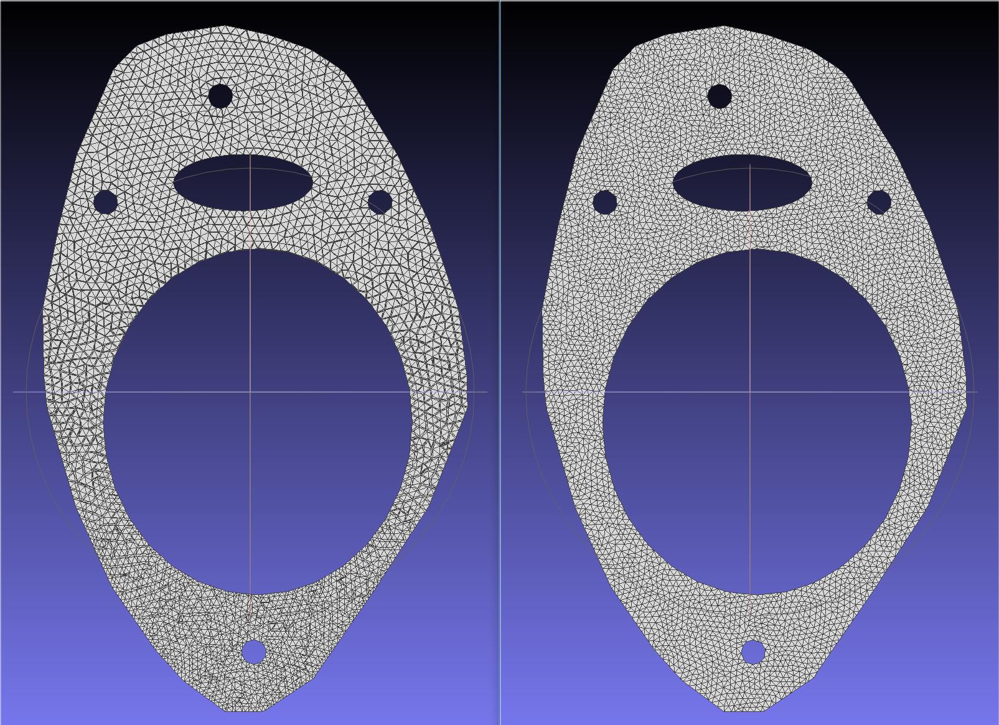

# remesh_bat
A tool to do remesh based on MeshLab (Version: 2020.07)

Starting from MeshLab v2020.12, the meshlabserver does not exist anymore, and was replaced by pyMeshLab (running mlx scripts through Python).

Please check the remesh.zip of Issue 1 which include the new version of remesh method, only a double click on remesh.py is needed, cheers.

## Usage
**Step 0: Download this repository and unzip it into one folder**
For example, the directory is "C:\PHD\Code\S3_DeformFDM\DataSet\remesh_operation"

**Step 1: Install MeshLab and copy the "remesh_slim.bat" into the intall directory of Meshlab**
Modify the parameter at Line 2 according to the path in step 0, for example, the code in line 2 is "set File_dir=C:\PHD\Code\S3_DeformFDM\DataSet\remesh_operation"

**Step 2: Modify "remesh_slimmedLayer.bat"**
Change the "File_dir" and "MeshLab_dir" according to the path of the repository and Meshlab installed directory. For example, "set File_dir=C:\PHD\Code\S3_DeformFDM\DataSet\remesh_operation
set MeshLab_dir=C:\Program Files\VCG\MeshLab"

**Step 3: Run remesh**
The original mesh will read from the "layers_unremeshed" folder and the remeshed mesh will be put into the "layers_remeshed" folder.

